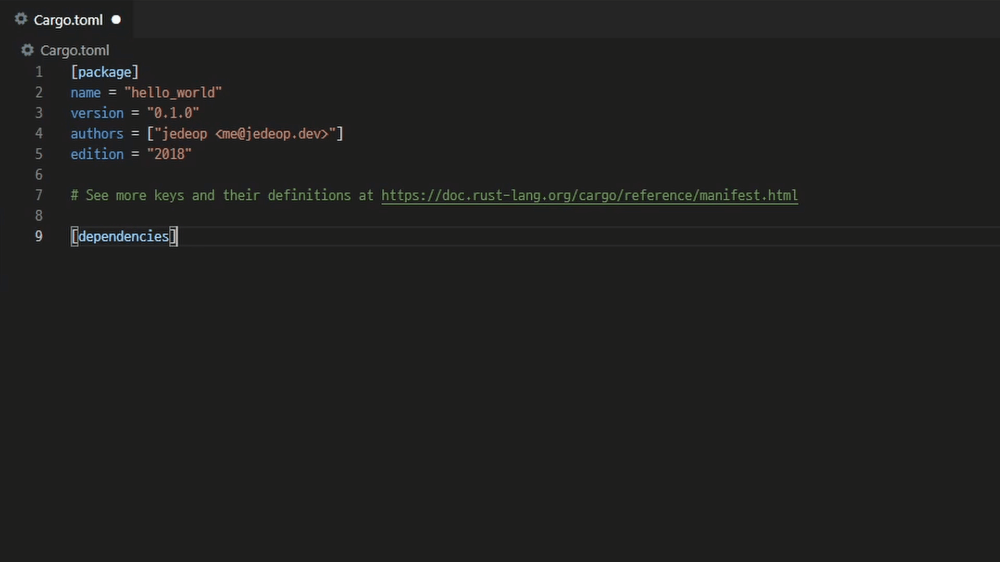

# Crates Completer

Auto completion for crates in dependencies table in `Cargo.toml`.  
It works with `crates.io` API.

## Features

- suggest crate name and auto complete with latest stable version
- suggest crate version

## Inspired by
- [search-crates-io](https://github.com/belfz/search-crates-io) - Visual Studio Code extension for crates suggestions in Cargo.toml 

## Release Notes

### 1.2.1

#### Fixed
- extension is not activated when `Cargo.toml` is in subdir
- auto completion not work after array in inline table

### 1.2.0

#### Add
- auto completion in all kind of `dependencies` table
- version auto completion in inline table (eg. `crate = { version = "" }`)
- add detail/documentation to completion item

### 1.1.0

#### Add
- auto completion also works in `dev-dependencies` table

#### Fixed
- version suggestion order is incorrect

### 1.0.1

#### Add
- logo and preview image

### 1.0.0

Initial release