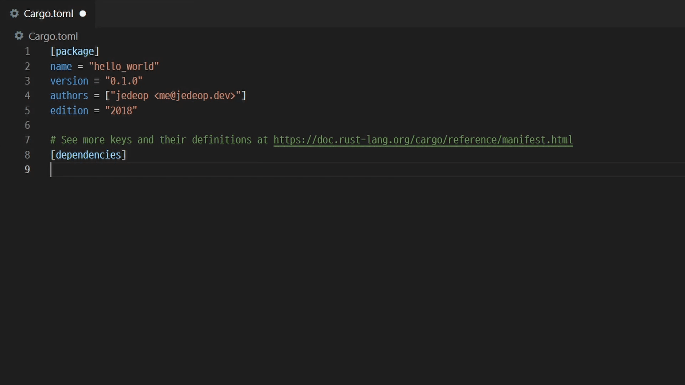

# Crates Completer

IntelliSense for crates in dependencies table in `Cargo.toml`.  
It works with `crates.io` API.

## Features

- suggest crate name and auto complete with latest stable version
- suggest crate version

## Inspired by
- [search-crates-io](https://github.com/belfz/search-crates-io) - Visual Studio Code extension for crates suggestions in Cargo.toml 

## Release Notes

### 1.0.1

Add logo and preview

### 1.0.0

Initial release